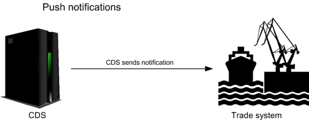
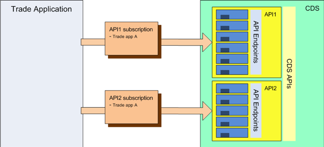
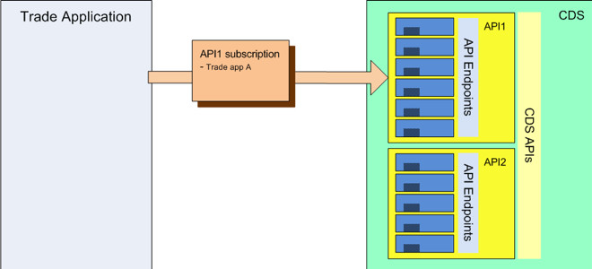
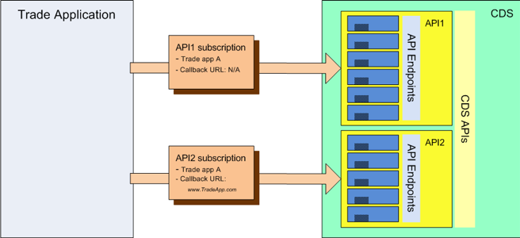
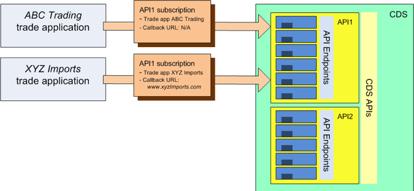
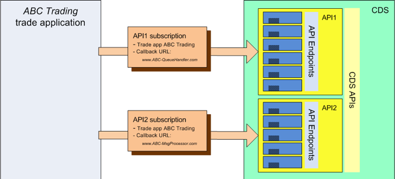
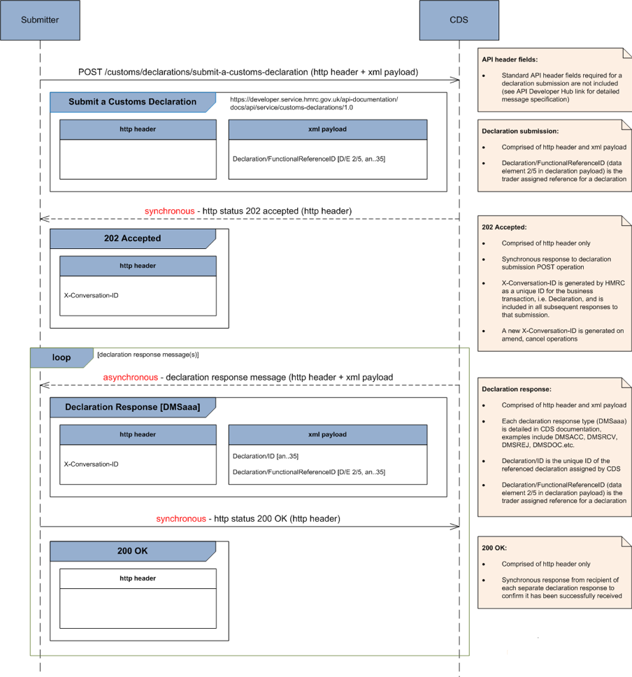
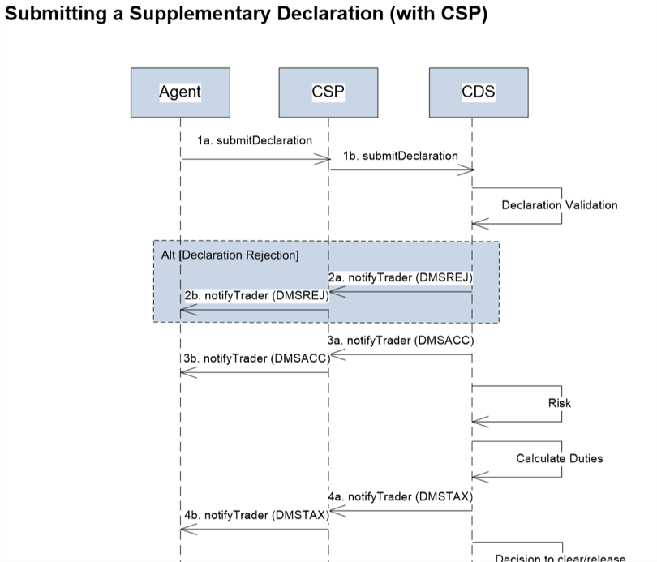
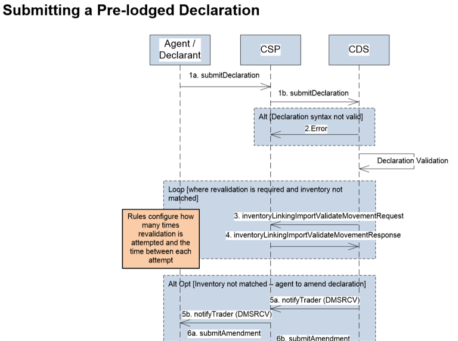

# Customs Declaration Service end-to-end service guide

This service guide explains how you can integrate your software with our APIs to help complete and submit Customs Declarations.

It shows how the APIs fit into various end-to-end user journeys and it is intended to help software developers, designers, product owners and business analysts to understand how your software needs to interact with HMRC systems.

## Overview
Customs Declarations Service (CDS) is replacing the Customs Handling of Import and Export Freight (CHIEF) with a modern and flexible system that can handle anticipated future import and export growth.

[More information about the Customs Declaration Service (opens in a new tab)](https://www.gov.uk/government/collections/customs-handling-of-import-and-export-freight-chief-replacement-programme).

What you need to do to get ready for the CDS will depend on how you currently make declarations using CHIEF.

[How to prepare for the Customs Declaration Service (opens in a new tab)](https://www.gov.uk/guidance/how-hmrc-will-introduce-the-customs-declaration-service).

For users who import or export outside of the European Union, there will be differences in the information they need to put in their declarations. This is due to changes to the [UK Trade Tariff (opens in a new tab)](https://www.gov.uk/government/collections/uk-trade-tariff-volume-3-for-cds) required by the Union Customs Code.

It is possible to complete and submit Customs Declarations using commercial software. To support this, we provide APIs to enable your application to:

- Make a customs declaration
- Receive business event notifications generated from requests submitted via the CDS APIs

Applications produced by external developers must subscribe to all of the CDS APIs that they wish to use. This enables access to the endpoints within the APIs. An application may subscribe to a single API or to multiple APIs.

Each subscription uniquely links a single external application to a single CDS API, and records the information associated with that unique link.

To use these APIs you must:
-	[Have an appropriate HMRC online account (opens in a new tab)](https://www.gov.uk/log-in-register-hmrc-online-services).
-	[Have an Economic Operator Registration and Identification (EORI) number (opens in a new tab)](https://www.gov.uk/eori).
-	Be registered for CDS
-	Have a working understanding of HTTP
-	Have a working understanding of OAuth2
-	Have a working knowledge of RESTful services
-	Have a working knowledge of XML

Some APIs are restricted to Community System Providers (CSPs) (5 companies - large operators who own most of the major ports)
CSPs have relationship with CHIEF – inventory linking (port to HMRC).

## Notifications
### Defining use of notifications
Part of an application’s subscription to an API, defines how notifications from the API will be delivered to that particular application.
All of the CDS APIs offer push and pull notifications. The details of each application’s subscription determines which mechanism (push or pull) is used for each application.

If the application’s subscription specifies a push notification callback URL, that will indicate that the API should use push notifications for that application – and should send those notifications to the supplied URL.

If the application’s subscription omits a callback URL, that will indicate to the API that pull notifications should be used with that application.

### Receive a Notification
**Push notifications**
-	The push notification mechanism sends notifications out to the trade system as those notifications become available. i.e. CDS ‘pushes’ notifications as they are generated, and the trade system needs to be constantly ready to receive them
-	Although pushed notifications remain in CDS for a short time after being delivered, there are no API endpoints that would enable a re-delivery to be requested

**Pull notifications**
-	The pull notification mechanism holds available notifications for subsequent retrieval by the consuming system. i.e. The trade system ‘pulls’ notifications when it is ready to do so
-	API endpoints allow identification of those notifications and the retrieval of selected notifications
-	Pull retrieval also enables (within limits) previously read notifications to be re-read if necessary

## API Subscription Model
### Application Subscription
Applications produced by external developers must subscribe to all of the CDS APIs that they intend to use. A subscription to an API will permit the subscribing application to access the endpoints within that API. An application may subscribe to a single API or to multiple APIs.

Each subscription uniquely links a single external application (typically a trade system) to a single CDS API, and records the information associated with that unique logical link.

## Scope of subscription
Because an API subscription uniquely links a single external application to a single CDS API, the scope of that subscription’s data is also limited to that unique association.
- The subscription to an API defines the notification mechanism, and hence all endpoints within a single API must share the same notification mechanism for a given subscription
- An API requires a separate subscription for each application wishing to use that API, and hence a single API may use different notification mechanisms for different applications.

### Use of single / multiple APIs
An application may subscribe to multiple APIs:

Alternatively an application may only subscribe to a single API:

### Mixed application notification mechanisms
An application may use push notifications for one subscription but use pull notifications for another subscription.

In this example, the trade application uses pull notifications for API1 since no call back is defined. For API2, the same application will use push notifications to the defined callback URL:

### Mixed API notifications
An single API may use different notification models for different application subscriptions.
In this example, two separate applications (ABC Trading & XYZ Imports) have subscribed to the same CDS API.
The ABC Trading application has not defined a callback URL and will therefore use pull notifications. The XYZ Imports application is using push notifications, sent to the supplied callback URL:

### Mixed callback URLs
Because each callback URL is defined as part of a subscription, an application may define different callback URLs for different push notifications. In this example, although a single application has subscribed to both API1 and API2, the push notifications from each API will be sent to a different URL because different URLs are specified in the two subscriptions:

## End-to-end user journeys
These journeys show examples of how to use the APIs. 
### Submit Customs Declaration to CDS
Submitter (individual, agent or CSP) submits a Customs Declaration to CDS:

### Submit a supplementary declaration via a CSP
The initial API call is step 1b where the CSP’s application calls the CDS API. At this point the CDS authentication mechanism is able to identify the application making the API call – and to associate the transaction with that application.
Later in the declaration processing, the submission undergoes risking and duty calculation and then produces a subsequent notification for the CSP in step 4a.
- Where step 4a is using a push notification, the CDS system will use the identity of the application from step 1b to determine the relevant subscription – and hence the destination URL for the push delivery
- Where step 4a is using a pull notification, the CDS system will store the message locally and wait for the agent’s software to retrieve it

 

### Submit a pre-lodged inventory linked declaration
The initial API call is step 1b where the CSP’s application calls the CDS API. As with the previous example, this is the point at which the CDS authentication mechanism is able to identify the application making the API call – and to associate the transaction with that application.
Later in the declaration workflow (step 3, after validation of the declaration) CDS sends a Validate Movement Request for processing by the CSP’s inventory linking system.
- Where step 3 is using a push notification, the CDS system will use the identity of the application from step 1b to determine the relevant subscription – and hence the destination URL for the push delivery
- Where step 3 is using a pull notification, the CDS system will store the message locally and wait for the agent’s or declarant’s software to retrieve it

Other use cases are described in [CDS 10 End to End Sequence Diagrams v2.5](figures/CDS%2010%20End%20to%20End%20Sequence%20Diagrams%20v2.5%20180721%20BW.pdf)
## Related API documentation
[Customs Declarations API](https://developer.qa.tax.service.gov.uk/api-documentation/docs/api) 
This API enables your application to submit a Customs Declaration.
[Pull Notifications API](https://developer.service.hmrc.gov.uk/api-documentation/docs/api/service/api-notification-pull/1.0) 
This API enables your application to “pull” business event notifications CDS has generated from requests submitted via the CDS APIs. 
Other APIs related to the CDS APIs:
-	Customs Inventory Linking Exports API
-	Customs Inventory Linking Imports API (CSP Only)
-	Bulk Data File List (list of tariff codes)

Other documentation related to CDS APIs: 
-	[UK Trade Tariff](https://www.gov.uk/government/collections/uk-trade-tariff-volume-3-for-cds)
-	[CDS 01 Inventory Linking Exports Service Design](https://drive.google.com/file/d/1UgbLY0M4ZzxVUjuJT0UEfGFz3mC3d7xT/view?usp=sharing)
-	[CDS 01 ILE Technical Completion Matrix](https://drive.google.com/file/d/1ahinP1dytvl1EB9K3qDkPR2kTFKtVfa0/view?usp=sharing)
-	[CDS 02 Inventory Linking Imports Service Design](https://docs.google.com/document/d/1KJB410mHnFSVO4njKGFD_4udj_K8Xc2bj2ZHy21sJRg/edit?usp=sharing)
-	[Tariff_Data_Export.pdf](https://drive.google.com/file/d/1ejsv83pYZtJ_0xrGjExQ12HcpoPYN5-6/view?usp=sharing)
-	[DispatchDataExport-XML-Data.xsd](https://drive.google.com/file/d/1MO5v5MrenBOod-ZQLmLtXp7xfqncueIh/view?usp=sharing)
-	[ECDP-Tariff Web services documentation (Annex IV)](https://drive.google.com/file/d/1-IgFb5HHlRgY3BrJxiuywMYE7TzfcCO7/view?usp=sharing)
-	[Taric User Guide](https://drive.google.com/file/d/1hc1c2Gf263yWttBGi0XP_hvandjx6k6e/view?usp=sharing)
-	[CDS – Tariff Download service -Identifying Duty Rates v1.0](https://drive.google.com/file/d/1xdvObWHuKVCQVYui2V_s7HlUyGSMkNJK/view?usp=sharing)
## Errors
Errors specific to each API are shown in the Endpoints section, under Response. See our [reference](https://developer.service.hmrc.gov.uk/api-documentation/docs/reference-guide#errors) guide for more on errors.
Specific CDS backend errors: CDS 03 Codelists and WCO References.

To change the title of the page or include additional files you'll need to edit `source/index.html.md.erb`.

If you want slightly more control, you can always use <strong>HTML</strong>.

For more detail and troubleshooting, take a look at the `README.md` file in the root of this project.
