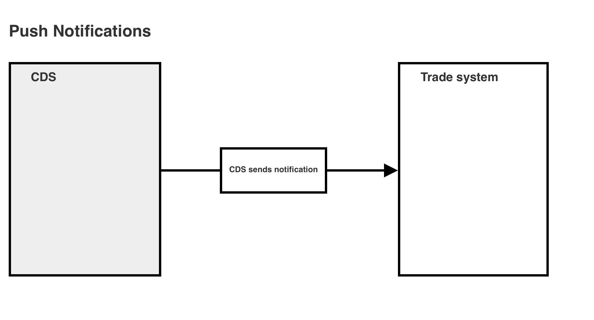
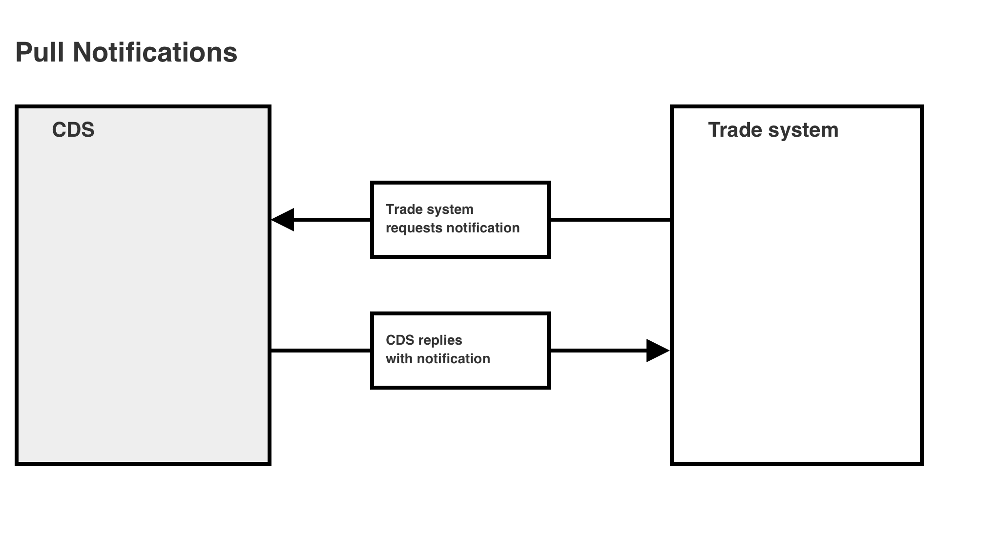
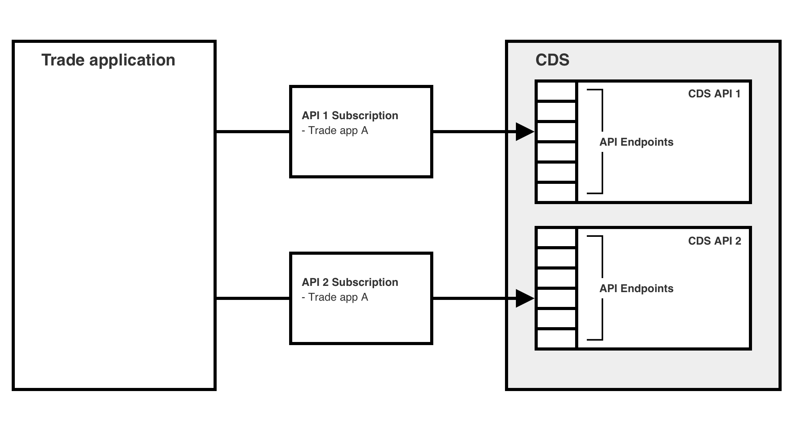
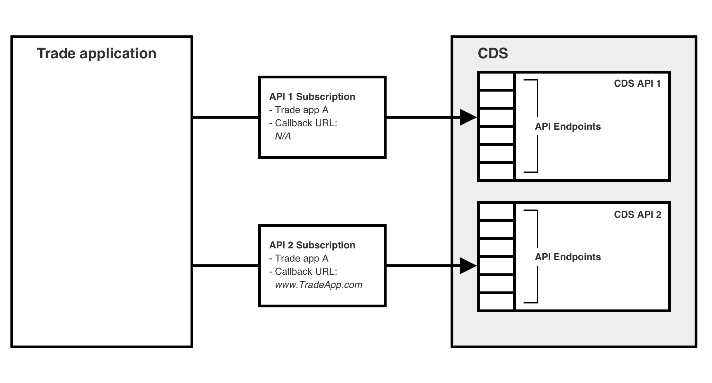
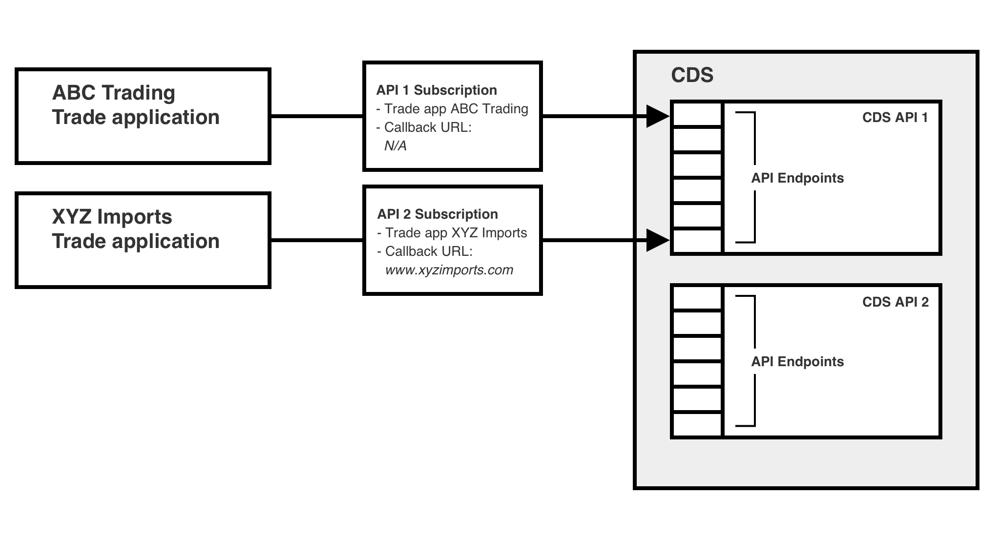
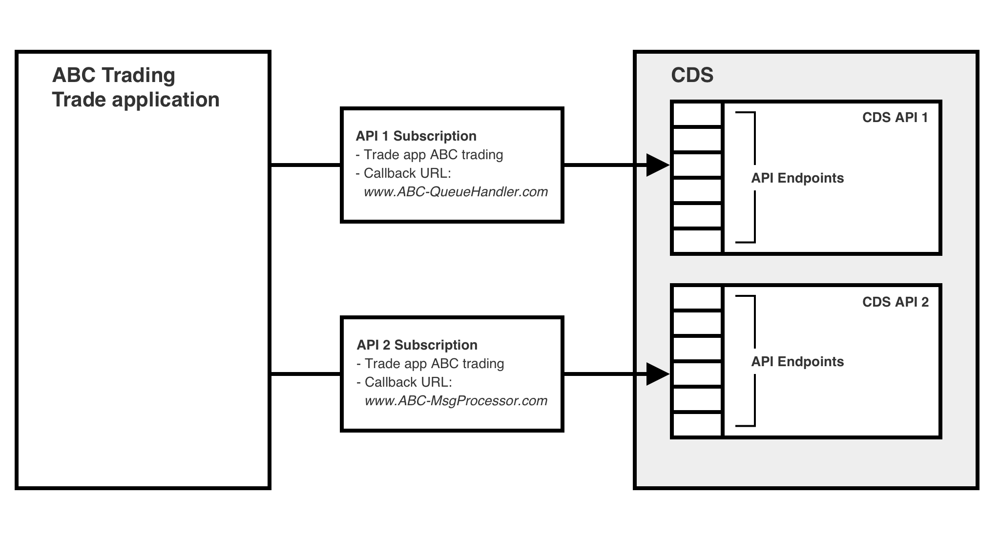

# Set up for Developers

## Notifications
Part of an application’s subscription to an API defines how notifications from the API will be delivered to that particular application.
All of the CDS APIs offer push and pull notifications.

**Push notifications**

-	The push notification mechanism sends notifications out to the trade system as those notifications become available. i.e. CDS ‘pushes’ notifications as they are generated, and the trade system needs to be constantly ready to receive them
-	Although pushed notifications remain in CDS for a short time after being delivered, there are no API endpoints that would enable a re-delivery to be requested

**Pull notifications**

-	The pull notification mechanism holds available notifications for subsequent retrieval by the consuming system. i.e. The trade system ‘pulls’ notifications when it is ready to do so
-	API endpoints allow identification of those notifications and the retrieval of selected notifications
-	Pull retrieval also enables (within limits) previously read notifications to be re-read if necessary

## API Subscription Model
### Application Subscription
Applications produced by external developers must subscribe to all of the CDS APIs that they intend to use. A subscription to an API will permit the subscribing application to access the endpoints within that API. An application may subscribe to a single API or to multiple APIs.

The details of each application’s subscription determines which mechanism (push or pull) is used for each application.

If the application’s subscription specifies a push notification callback URL, that will indicate that the API should use push notifications for that application – and should send those notifications to the supplied URL.

If the application’s subscription omits a callback URL, that will indicate to the API that pull notifications should be used with that application.

Each subscription uniquely links a single external application (typically a trade system) to a single CDS API, and records the information associated with that unique logical link.

## Scope of subscription
Because an API subscription uniquely links a single external application to a single CDS API, the scope of that subscription’s data is also limited to that unique association.

- The subscription to an API defines the notification mechanism, and hence all endpoints within a single API must share the same notification mechanism for a given subscription
- An API requires a separate subscription for each application wishing to use that API, and hence a single API may use different notification mechanisms for different applications.

### Use of single / multiple APIs
An application may subscribe to multiple APIs:

Alternatively an application may only subscribe to a single API:

### Mixed application notification mechanisms
An application may use push notifications for one subscription but use pull notifications for another subscription.

In this example, the trade application uses pull notifications for API1 since no call back is defined. For API2, the same application will use push notifications to the defined callback URL:

### Mixed API notifications
A single API may use different notification models for different application subscriptions.
In this example, two separate applications (ABC Trading & XYZ Imports) have subscribed to the same CDS API.
The ABC Trading application has not defined a callback URL and will therefore use pull notifications. The XYZ Imports application is using push notifications, sent to the supplied callback URL:

### Mixed callback URLs
Because each callback URL is defined as part of a subscription, an application may define different callback URLs for different push notifications. In this example, although a single application has subscribed to both API1 and API2, the push notifications from each API will be sent to a different URL because different URLs are specified in the two subscriptions:

