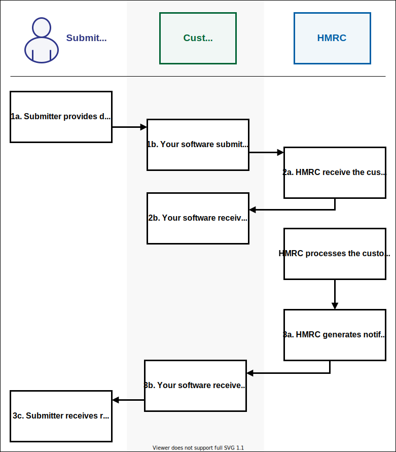

# Submit a customs declaration

### Submitter journey overview
The submitter of a declaration can be:

- an individual trader
- an agent acting on their behalf
- a CSP

1. Submit declaration
2. Receive response
3. Receive notifications related to declaration

### Submit declaration
Your software should use the [Customs Declarations API]((/api-documentation/docs/api/service/customs-declarations)) to do this - specifically the [Submit a customs declaration](/api-documentation/docs/api/service/customs-declarations/1.0#_submit-a-customs-declaration_post_accordion) endpoint.

If you are a CSP you must identify the originating party of the declaration.

### Receive response
You will receive a synchronous response confirming that your declaration has been received.

This response will include a Conversation ID that you can use to identify notifications for your declaration.

After a short time one or more notifications related to your declaration will be generated.

### Receive notifications related to declaration
How you receive notifications depends on whether you have set up Push or Pull notifications for your subscription to the [Customs Declarations API]((/api-documentation/docs/api/service/customs-declarations)).

If your subscription has a callback URL then you will receive a Push notification.

Otherwise you can use the Pull notification API to [get unpulled notifications for the Conversation ID received](/api-documentation/docs/api/service/api-notification-pull/1.0#_get-all-notifications-for-a-conversation_get_accordion).

Notifications will include a unique identifier for the declaration assigned by CDS.

If the declaration is Accepted you will receive a DMSACC notification.

If the declaration is Rejected you will receive a DMSREJ notification.

If you need to supply supporting documents you will receive a DMSDOC notification.
