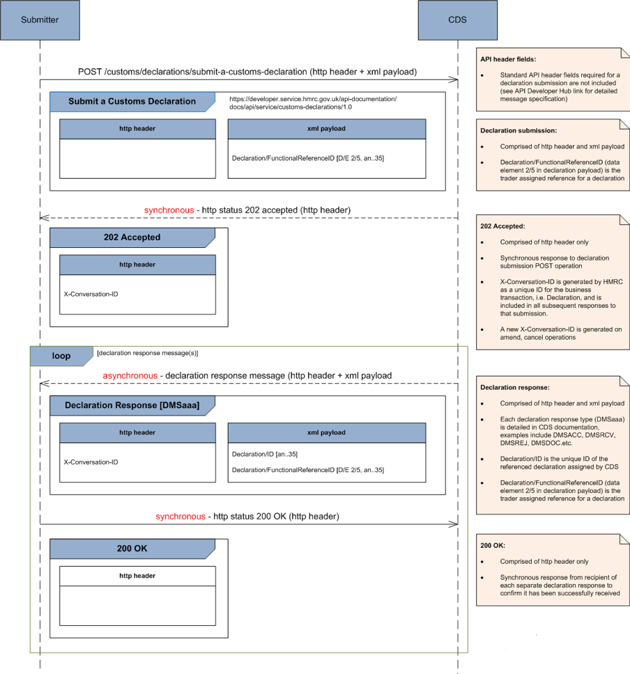

# Submit Customs Declarations

### Submit Customs Declaration to CDS
Submitter (individual, agent or CSP) submits a Customs Declaration to CDS:

### Submit a supplementary declaration via a CSP
The initial API call is step 1b where the CSP’s application calls the CDS API. At this point the CDS authentication mechanism is able to identify the application making the API call – and to associate the transaction with that application.
Later in the declaration processing, the submission undergoes risking and duty calculation and then produces a subsequent notification for the CSP in step 4a.

- Where step 4a is using a push notification, the CDS system will use the identity of the application from step 1b to determine the relevant subscription – and hence the destination URL for the push delivery
- Where step 4a is using a pull notification, the CDS system will store the message locally and wait for the agent’s software to retrieve it

 

### Submit a pre-lodged inventory linked declaration
The initial API call is step 1b where the CSP’s application calls the CDS API. As with the previous example, this is the point at which the CDS authentication mechanism is able to identify the application making the API call – and to associate the transaction with that application.
Later in the declaration workflow (step 3, after validation of the declaration) CDS sends a Validate Movement Request for processing by the CSP’s inventory linking system.

- Where step 3 is using a push notification, the CDS system will use the identity of the application from step 1b to determine the relevant subscription – and hence the destination URL for the push delivery
- Where step 3 is using a pull notification, the CDS system will store the message locally and wait for the agent’s or declarant’s software to retrieve it

Other use cases are described in [CDS 10 End to End Sequence Diagrams v2.5](figures/CDS%2010%20End%20to%20End%20Sequence%20Diagrams%20v2.5%20180721%20BW.pdf)